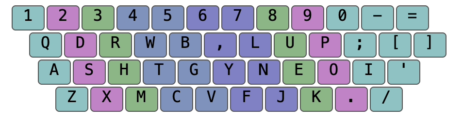

# Workman Keyboard Layout for X11 (Optimized for Vim)

Workman is an alternative keyboard layout originally proposed by OJ Bucao: [https://workmanlayout.org](https://workmanlayout.org)

This version is optimized for Vim users and improves ergonomic efficiency. If you're learning it cold-turkey, consider printing the included keyboard image for desk reference.



## Installation

Download the `.Xmodmap` file directly to your home directory:

```bash
wget -O ~/.Xmodmap https://raw.githubusercontent.com/twichai/Workman-for-vim/master/xmodmap/xmodmap.workman
```

Activate the layout with:

```bash
xmodmap ~/.Xmodmap
```

## Make It Persistent

To apply the layout automatically on login, add the following line to your `.xinitrc` or `.xsession` file:

```bash
xmodmap ~/.Xmodmap
```

## Notes

- This layout is intended for X11 systems (e.g., most Linux desktops).
- Back up your existing `.Xmodmap` before replacing it.

## Uninstallation

To revert to your default layout, delete the `.Xmodmap` file (or restore your backup), then run:

```bash
setxkbmap us
```

---

## Layout Analysis

### Finger Frequency

| Finger | % Usage | Finger | % Usage |
|--------|---------|--------|---------|
| 0 (L)  | 7.94%   | 9 (R)  | 8.36%   |
| 1 (L)  | 10.36%  | 8 (R)  | 10.12%  |
| 2 (L)  | 14.00%  | 7 (R)  | 15.34%  |
| 3 (L)  | 17.37%  | 6 (R)  | 16.50%  |
| **Total L** | **49.67%** | **Total R** | **50.33%** |

### Finger Bigram Frequency

| Finger | Bigram % | Finger | Bigram % |
|--------|-----------|--------|-----------|
| 0 (L)  | 0.028%    | 9 (R)  | 0.250%    |
| 1 (L)  | 0.127%    | 8 (R)  | 0.446%    |
| 2 (L)  | 0.279%    | 7 (R)  | 0.483%    |
| 3 (L)  | 0.361%    | 6 (R)  | 1.316%    |
| **Total** | **3.291%** |        |           |

### Top Same-Finger Bigrams

| Finger | Bigram | Frequency |
|--------|--------|-----------|
| 6 (R)  | LY     | 0.417%    |
| 7 (R)  | KE     | 0.339%    |
| 8 (R)  | PO     | 0.256%    |
| 3 (L)  | CT     | 0.200%    |
| 6 (R)  | N,     | 0.185%    |

### Top Neighbour-Finger Bigrams

| Fingers  | Bigram | Frequency |
|----------|--------|-----------|
| 8-7 (R)  | OU     | 1.442%    |
| 0-1 (L)  | AS     | 0.987%    |
| 0-1 (L)  | AD     | 0.504%    |
| 1-2 (L)  | SH     | 0.482%    |
| 8-7 (R)  | PE     | 0.381%    |

### Finger Effort

| Finger | Base | Same-Finger Bigrams | Neighbour-Finger Bigrams | Total |
|--------|------|---------------------|---------------------------|--------|
| 0 (L)  | 0.133 | 0.001 | 0.014 | 0.148 |
| 1 (L)  | 0.188 | 0.004 | 0.002 | 0.194 |
| 2 (L)  | 0.250 | 0.010 | -0.010 | 0.249 |
| 3 (L)  | 0.315 | 0.011 |        | 0.326 |
| 6 (R)  | 0.320 | 0.040 |        | 0.360 |
| 7 (R)  | 0.204 | 0.015 | -0.008 | 0.210 |
| 8 (R)  | 0.166 | 0.014 | 0.005  | 0.184 |
| 9 (R)  | 0.167 | 0.007 | 0.007  | 0.181 |
| **Total** | **1.743** | **0.101** | **0.009** | **1.854** |
